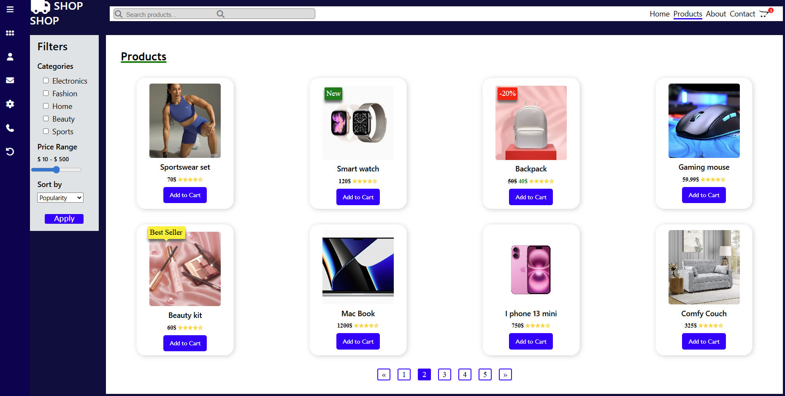

# My Product Page

## Description

Hello world 👋

Today I’m back with another project!

This time I built a clean and responsive e-commerce shop using only HTML and CSS. No JavaScript, no frameworks, just pure front-end fundamentals. This project is perfect for people who want to improve their CSS & HTML skills.

It includes a product grid, sidebar filters, search bar, product badges, ratings, and pagination and much more. Everything is fully responsive and built with Flexbox, Grid, and media queries.

Here's what the product page looks like:  



## 🚀 How to Run It

1. Clone the repo
````
 git clone https://github.com/emmanuellerayssa/My-product-page.git
````

2. Go to the project folder and open the productpage.html file with your favorite browser.
3. Voilà! The web page is displayed in your web browser.

<b>Don’t hesitate to resize the viewport to see how the web page adapts to different screen sizes</b>

<b>PS: </b> I do not own the rights to the images included in the images folder.

## Improvement Ideas
To go further, you can add some JavaScript to have a fully dynamic web page or add product detail pages. 

Hope this little project will be as fun to you as it was to me. See you soon for another fun project.
